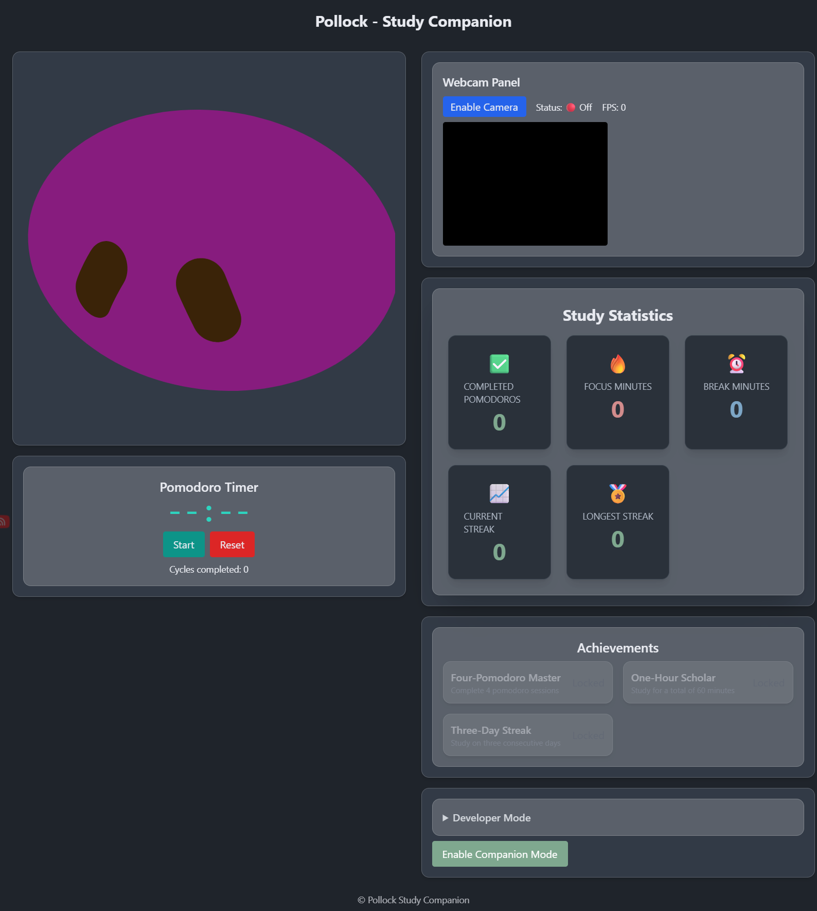
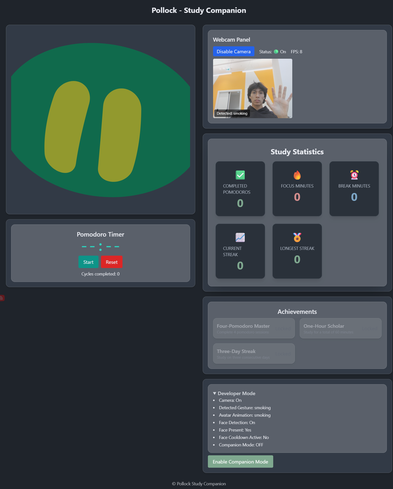
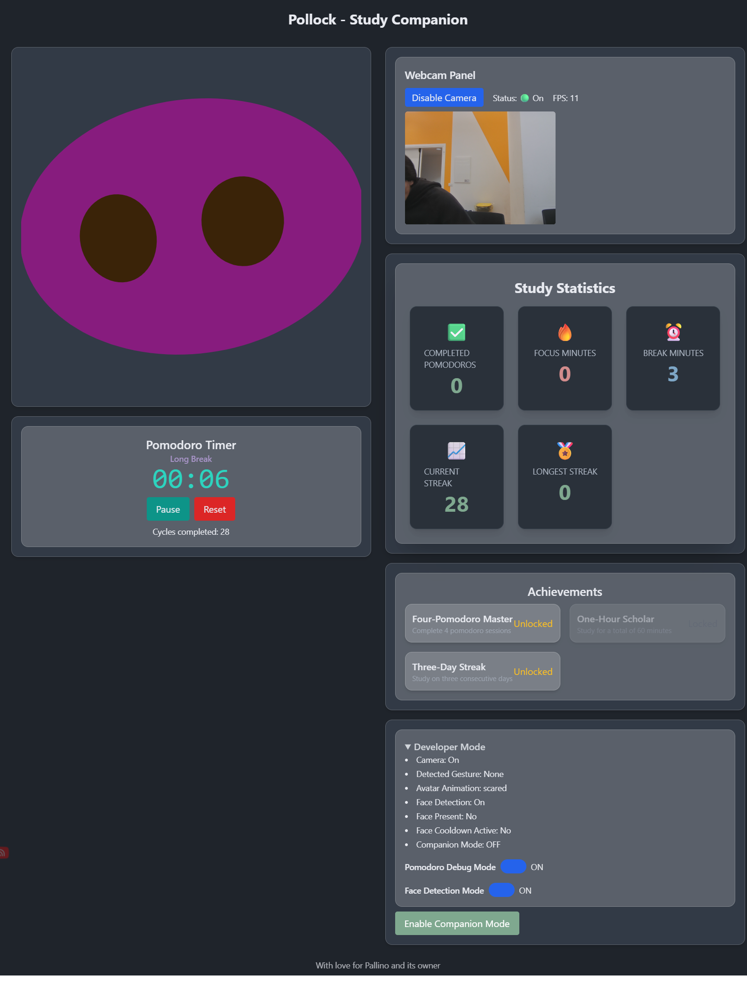
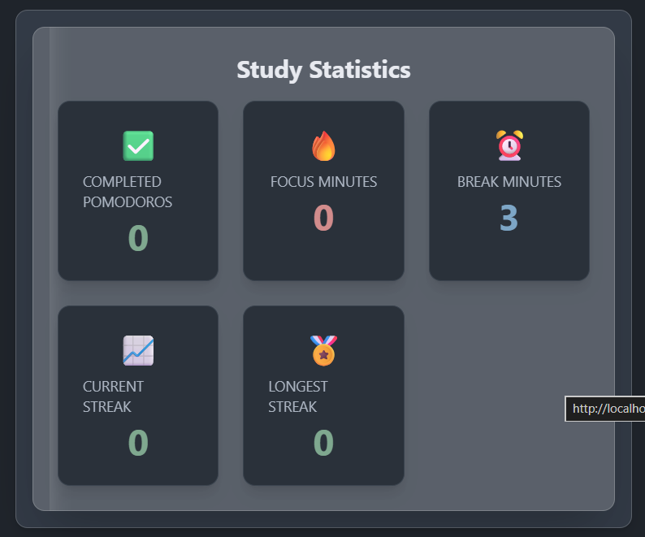
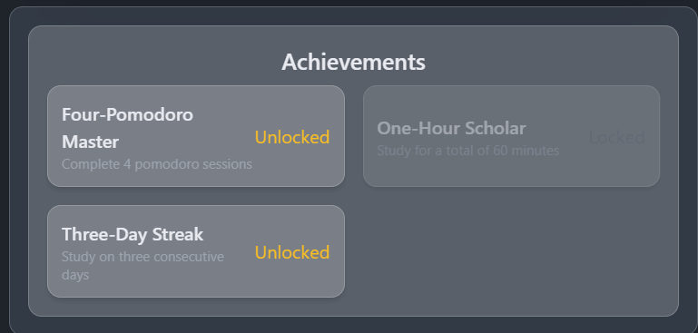

# Study Companion

A browser-based study companion that combines a Pomodoro timer, MediaPipe-powered gesture recognition, face presence detection, and an animated avatar to create a more engaging study experience.

The application runs entirely in the browser and does not require any backend services. It uses computer vision to react to the user's presence and gestures while helping maintain focus through Pomodoro sessions, statistics tracking, and achievements.

---

## Screenshots

### Overview

### Gesture Recognition
Open Hand for smoking break 🚬

### Face Recognition
Pollock is scared if you don't show your face in 5 seconds!

### Pomodoro Timer
You can set a pomodoro session  of 25 minutes!

### Pomodoro Statistics
Track your study performance directly in the application!

### Achievements
Unlock achievements by studying consistently!

## Features

### Animated Study Companion

- Custom animated avatar inspired by the Bible Strong Avatar Lab project.
- Reacts to hand gestures.
- Reacts to face presence and absence.
- Reacts to Pomodoro events.
- Includes idle-state behaviors.

### Gesture Recognition

Implemented with MediaPipe Hand Landmarker.

Supported gestures:

|Gesture|Avatar Reaction|
|---|---|
|Peace Sign ✌️|Happy|
|Middle Finger 🖕|Angry|
|Index Finger ☝️|Listening|
|Open Hand ✋|Smoking|

### Face Presence Detection

Implemented with MediaPipe Face Detection.

Behavior:

- Face detected → Happy
- Face missing for more than 5 seconds → Scared
- Face returns → Happy

### Pomodoro Timer

Features:

- Focus Sessions
- Short Breaks
- Long Breaks
- Start / Pause / Resume / Reset
- Developer Debug Mode

Avatar reactions:

- Focus Session → Listening
- Break → Happy
- Session Complete → Proud

### Statistics

Track study performance directly in the application:

- Completed Pomodoros
- Total Focus Minutes
- Total Break Minutes
- Current Streak
- Longest Streak

### Achievements

Unlock achievements by studying consistently.

Examples:

- Four-Pomodoro Master
- One-Hour Scholar
- Three-Day Streak

### Companion Mode

A lightweight floating companion view that keeps the avatar and Pomodoro status visible while studying.

---

## Technology Stack

### Frontend

- React
- TypeScript
- Vite
- TailwindCSS

### State Management

- Zustand

### Computer Vision

- MediaPipe Hand Landmarker
- MediaPipe Face Detector

### Animation

- Bible Strong Avatar React Integration
- Framer Motion

---

## Architecture

Webcam  

│  

├── Hand Tracking  

│ └── Gesture Recognition  

│ └── Avatar Reactions  

│  

├── Face Detection  

│ └── Face Avatar Bridge  

│  

└── Shared Camera Stream  

  

Pomodoro  

│  

├── Statistics  

├── Achievements  

└── Avatar Reactions  

  

Avatar Priority  

  

Gesture  

> Face Detection  

> Pomodoro  

> Idle Manager

---

## Running Locally

### Requirements

- Node.js 22+

### Installation

git clone [https://github.com/gabrylimache/study-companion.git](https://github.com/gabrylimache/study-companion.git)  

  

cd study-companion  

  

npm install

### Start Development Server

npm run dev

### Production Build

npm run build

---

## GitHub Pages

The project is automatically deployed through GitHub Actions.

Live version:

[https://gabrylimache.github.io/study-companion/](https://gabrylimache.github.io/study-companion/)

---

## Future Improvements

- Fully functional Picture-in-Picture companion mode
- More avatar emotions and reactions
- Additional achievements
- Session history
- Weekly study analytics
- Mobile optimization

---

## Project Inspiration

This project has a personal story behind it.

The name and initial idea were inspired by a loved one of mine, Virginia Nicoletti. While preparing for an exam about the painter Jackson Pollock, discussions about studying, focus, and finding more engaging ways to learn eventually sparked the concept that became Study Companion.

What started as an attempt to help with exam preparation gradually evolved into a complete interactive study assistant driven by computer vision and avatar interactions.

---

## Credits

### Avatar System

Special thanks to the creators of the Bible Strong Avatar Lab project for providing the avatar framework that inspired and enabled the companion character used in this application.

Repository:

[https://github.com/smontlouis/bible-strong-avatar-lab](https://github.com/smontlouis/bible-strong-avatar-lab)

### Libraries & Tools

- React
- Vite
- Zustand
- MediaPipe
- TailwindCSS
- Framer Motion

---

## License

This project is intended for educational and portfolio purposes. Please review the licenses of all third-party libraries and assets before reusing them in other projects.

---
